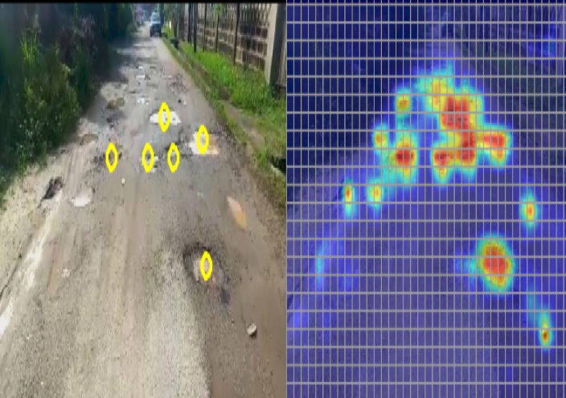
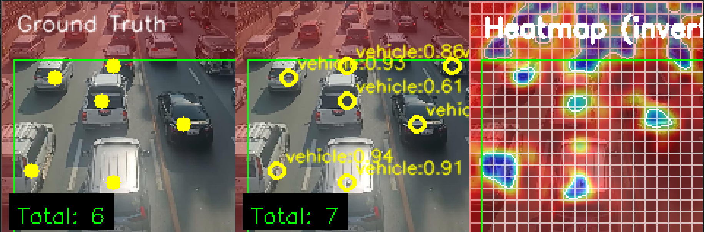
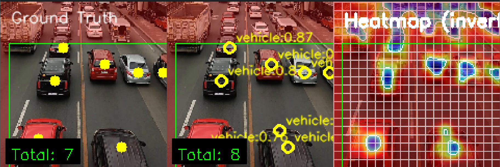
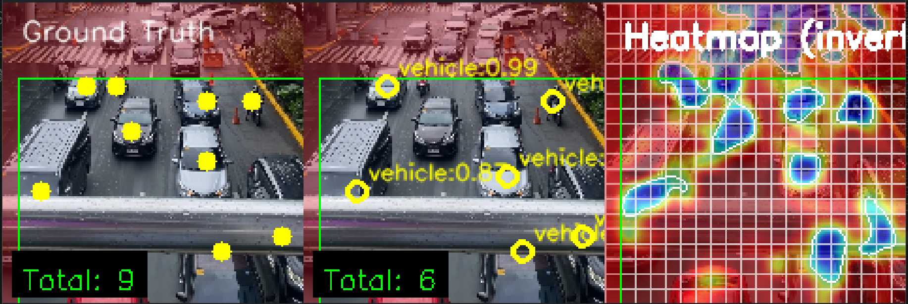

# About

**Faster Objects, More Objects (FOMO)** is an object detection technique that uses centroids instead of bounding boxes. It does this by outputting a heatmap and interpreting it in such a way where you could extract a centroid. 

This project is a best-effort attempt to reimplement a FOMO end-to-end pipeline in **PyTorch**. 

### 🎓 Capstone Context
This pipeline was originally developed as the computer vision component of a joint undergraduate capstone project focused on vehicle counting. It was trained using the backbones **MobileNetV2**, **ShuffleNetV2**, and **EfficientNet**.

For context, the broader capstone project involved:
1. Developing this FOMO pipeline to extract vehicle counts from MMDA traffic footage of a specific Philippine intersection.
2. A groupmate creating a traffic simulation of that same intersection.
3. Feeding the counts from this model into the simulation to create a live **digital twin**.

*(Note: This repository will only contain the PyTorch FOMO pipeline portion of the project.)*

> **Note:** I am currently in the process of refactoring the codebase and creating better documentation for this project.

# Project Checklist

- [ ] **Root Files**
  - [ ] `config.py`
  - [ ] `train.py`
  - [ ] `requirements.txt`
- [ ] **`data/`**
  - [ ] `__init__.py`
  - [ ] `class_mapping.py`
  - [ ] `coco_loader.py` (In progress)
  - [ ] `dataset.py`
  - [/] `transforms.py`
- [ ] **`models/`**
  - [ ] `__init__.py`
  - [ ] `backbone.py`
  - [ ] `export.py`
  - [ ] `fomo_model.py`
  - [ ] `head.py`
- [ ] **`training/`**
  - [ ] `__init__.py`
  - [ ] `loss.py`
  - [ ] `lr_scheduler.py`
  - [ ] `trainer.py`
- [ ] **`utils/`**
  - [ ] `__init__.py`
  - [ ] `device.py`
  - [ ] `gpu_monitor.py`
  - [ ] `io_helpers.py`
  - [ ] `seed.py`

# Current System Output & Capabilities
### 📸 Samples
**Model Output Previews:**

  
  
  

### 🚦 Traffic Flow & Estimation
The system is currently able to output models that can accurately sense objects, provided they do not cover too much of the frame. Because the models are highly capable of sensing object presence, it works very well for:
- Detecting whether traffic is flowing or stopped at intersections.
- Estimating the volume of vehicles present when traffic flow is paused.

### ⚠️ Known Limitations
Currently, the system does not take bounding box dimensions into consideration when assigning values to cells where objects exist. As this is not taken into account during training, the model's centroid detection capability is mostly reliable only for a specific category of camera frames.

However, it should be noted that while FOMO was created for centroid detection, the raw output of FOMO is a **heatmap**. There are multiple different ways to interpret this heatmap depending on the specific task, giving the model flexibility beyond strict centroid detection and there are multiple ways to interpret a heatmap for better centroid detection performance.
